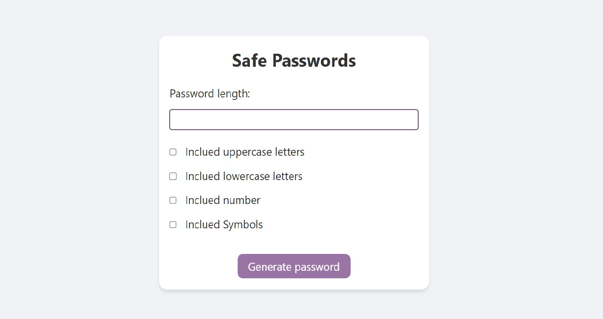

# 🔒 Gerador de Senhas Seguras

Um gerador de senhas simples, moderno e seguro, construído com HTML, CSS e JavaScript puro. Permite ao usuário personalizar o comprimento e os tipos de caracteres para criar senhas fortes e únicas com facilidade.

 

## 📋 Índice

- [Sobre o Projeto](#-sobre-o-projeto)
- [✨ Funcionalidades](#-funcionalidades)
- [🚀 Tecnologias Utilizadas](#-tecnologias-utilizadas)
- [🏁 Como Começar](#-como-começar)
  - [Pré-requisitos](#pré-requisitos)
  - [Instalação](#instalação)
- [🔧 Uso](#-uso)
- [📄 Licença](#-licença)

---

## 📖 Sobre o Projeto

Este projeto foi desenvolvido como uma forma prática de aprimorar habilidades em **JavaScript**, focando na manipulação do DOM e na criação de uma ferramenta útil para o dia a dia. O objetivo era criar uma interface limpa e intuitiva onde qualquer pessoa pudesse gerar senhas seguras sem complicações.

---

## ✨ Funcionalidades

- **Comprimento Personalizável:** Defina o tamanho da senha.
- **Seleção de Caracteres:** Escolha incluir letras maiúsculas, minúsculas, números e símbolos.
- **Geração Instantânea:** Crie uma nova senha com um único clique.
- **Copiar para a Área de Transferência:** Botão "Copiar" que copia a senha gerada e fornece feedback visual ao usuário.
- **Interface Responsiva:** Funciona bem em desktops e dispositivos móveis.
- **Feedback ao Usuário:** Mensagens claras informam quando a senha foi gerada e copiada.

---

## 🚀 Tecnologias Utilizadas

O projeto foi construído utilizando as seguintes tecnologias:

- **HTML5:** Para a estrutura semântica do conteúdo.
- **CSS3:** Para a estilização, layout e design responsivo.
- **JavaScript (ES6+):** Para toda a lógica funcional, manipulação de eventos e do DOM.

---

## 🏁 Como Começar

Para ter uma cópia local do projeto e executá-la, siga os passos abaixo.

### Pré-requisitos

Você só precisa de um navegador web moderno, como Google Chrome, Firefox ou Microsoft Edge.

### Instalação

1.  **Clone o repositório** (ou baixe o ZIP):
    ```sh
    git clone https://github.com/seu-usuario/safe_passwords.git
    ```

2.  **Navegue até a pasta do projeto**:
    ```sh
    cd safe_passwords
    ```

3.  **Abra o arquivo `index.html`** no seu navegador de preferência. E pronto!

---

## 🔧 Uso

A utilização da ferramenta é muito simples:

1.  Ajuste o tamanho da senha (`password length`) para definir o comprimento desejado para a sua senha.
2.  Marque as caixas de seleção para incluir os tipos de caracteres que você deseja:
    - `Incluir letras maiúsculas`
    - `Incluir letras minúsculas`
    - `Incluir números`
    - `Incluir símbolos`
3.  Clique no botão **"Gerar senha!"**.
4.  A nova senha segura aparecerá na seção abaixo.
5.  Clique em **"Copiar senha"** para salvá-la na sua área de transferência. O botão mudará de texto para "Senha copiada!" para confirmar a ação.

---

## 📄 Licença

Distribuído sob a Licença MIT. Veja o arquivo `LICENSE` para mais informações.

---

Feito por João Paulo Araújo. Entre em contato!

Email: jpaulofonseca99@gmail.com

LinkedIn: https://linkedin.com/in/joaofonsecaraujo
